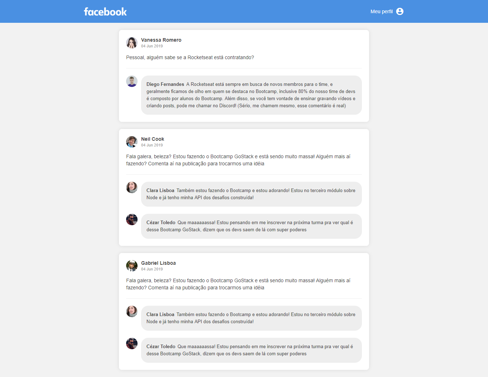

# Rocketseat Bootcamp Challenge - Introduction to React

The aim of this project was to develop a similar interface to Facebook using React.

## Steps to Setup

1. Install dependencies

```bash
> yarn
```

2. Run Server

```bash
> yarn dev
```

You can browse the apis at <http://localhost:8080>


